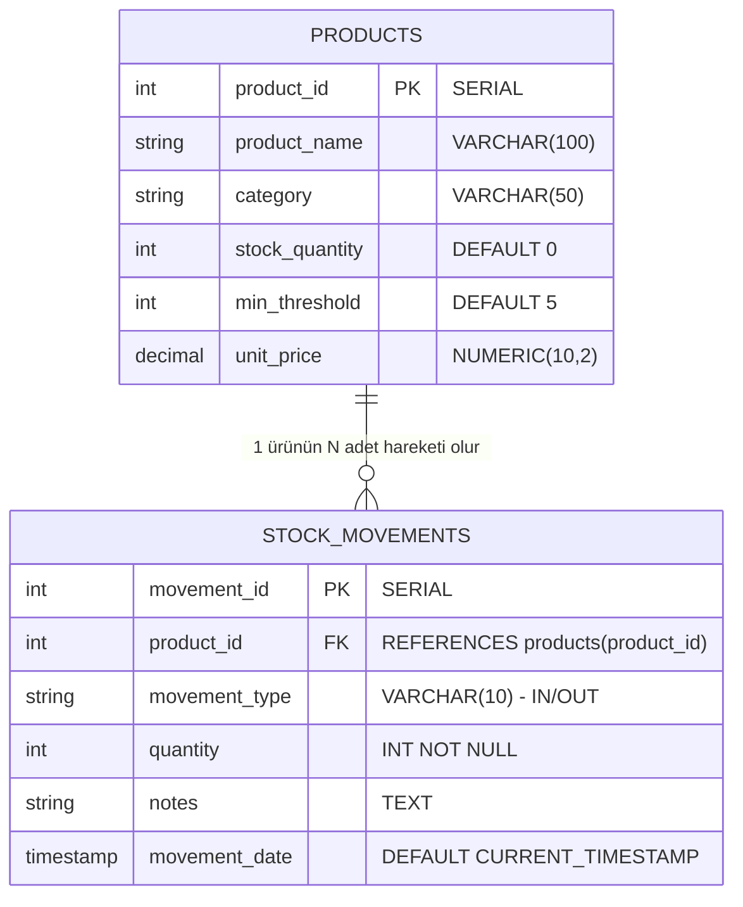

```mermaid
erDiagram
    PRODUCTS ||--o{ STOCK_MOVEMENTS : "1 ürünün N adet hareketi olur"

    PRODUCTS {
        int product_id PK "SERIAL"
        string product_name "VARCHAR(100)"
        string category "VARCHAR(50)"
        int stock_quantity "DEFAULT 0"
        int min_threshold "DEFAULT 5"
        decimal unit_price "NUMERIC(10,2)"
    }

    STOCK_MOVEMENTS {
        int movement_id PK "SERIAL"
        int product_id FK "REFERENCES products(product_id)"
        string movement_type "VARCHAR(10) - IN/OUT"
        int quantity "INT NOT NULL"
        string notes "TEXT"
        timestamp movement_date "DEFAULT CURRENT_TIMESTAMP"
    }
```
